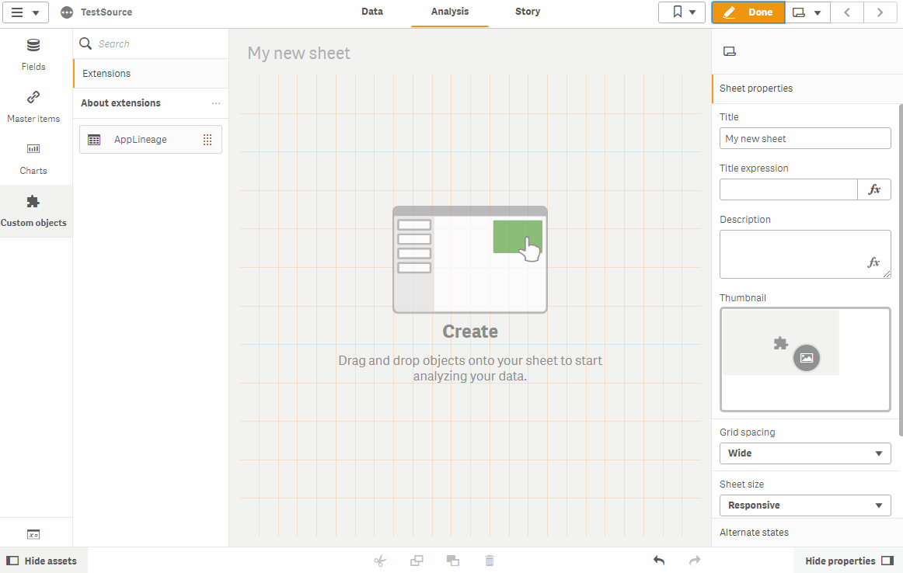

# WARNING

Tests in progress.

# QS-ApplicationSources_Ext
Qlik Sense extension.
List all files and queries which are loaded in the application.
Goal is to present a first step of data lineage.

**Author:** Baptiste Durand

**License**: MIT Licensed  

# Disclaimer

Created for a personal use.
This is NOT A QLIK PRODUCT. This is not supported.
No warranty, use at your own risks.
Not Documented.

# Use case
Give visibility to the users on the data scope loaded in the application by a dynamic extension.
Useful for Dashboard but also in a multi-layered data architecture (Get some ETL info without open script).
My goal is to explore Qlik Sense lineage capabilities.

# Example

How can I use it?

# How it works

Simple.
Choose to see raw Engine response or refined data.
Hide/Display "less" important info (Store, Resident, etc).

## Feedbacks / Tests needed :
Tests in different environment to check API Engine responses.
